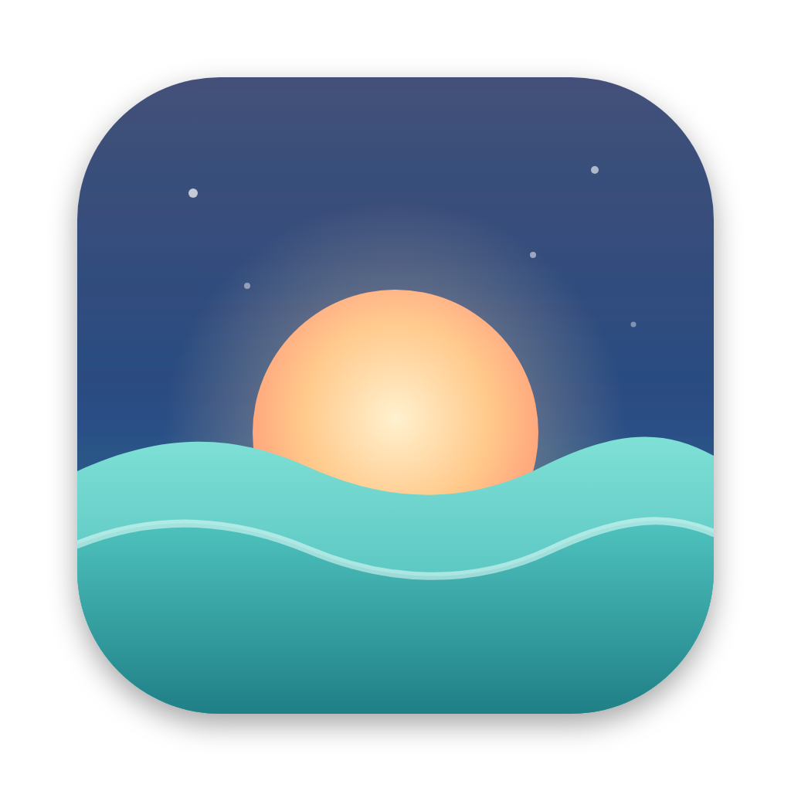
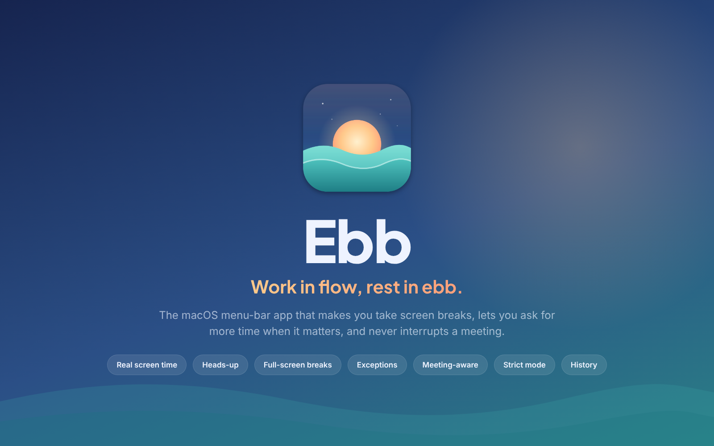
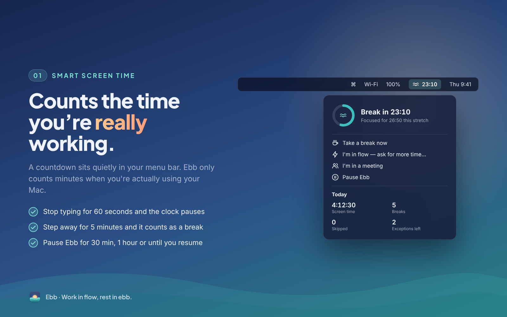
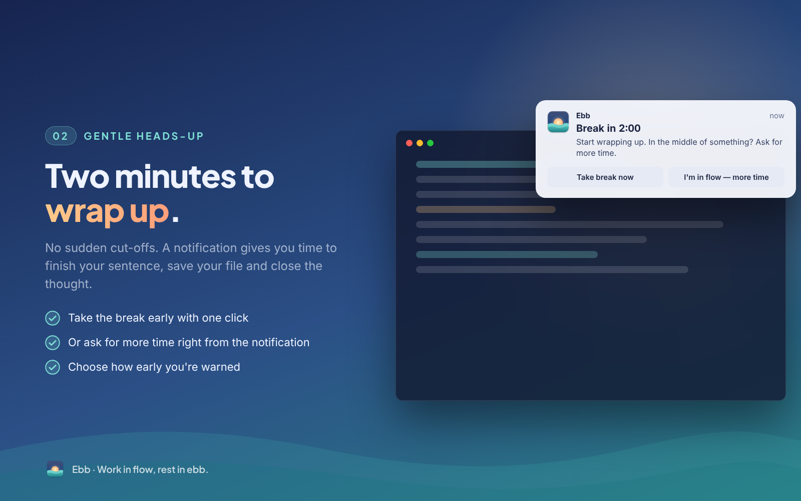
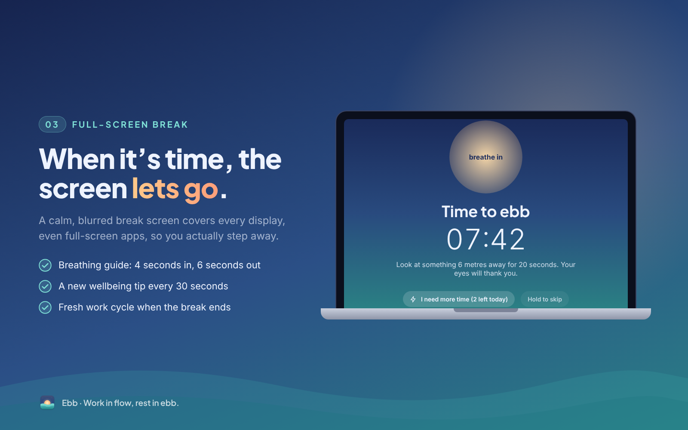
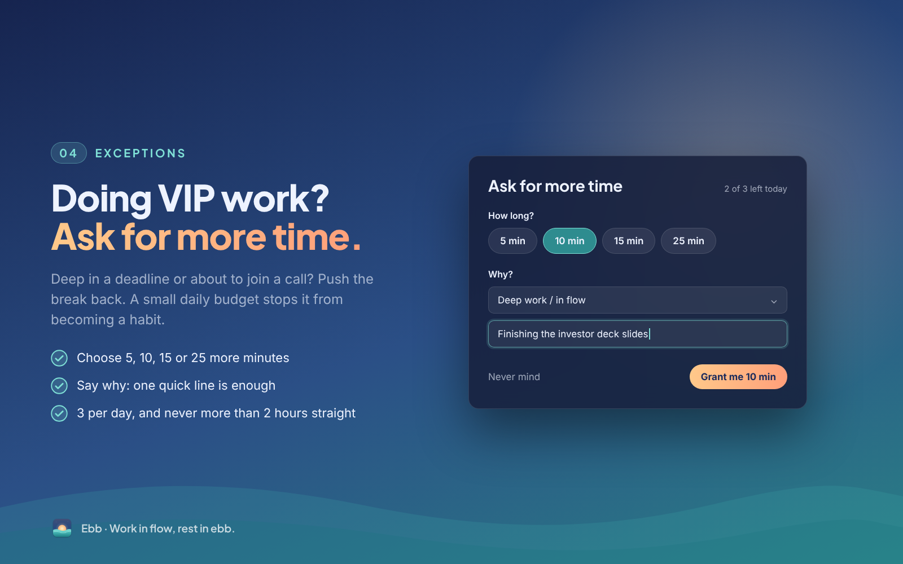
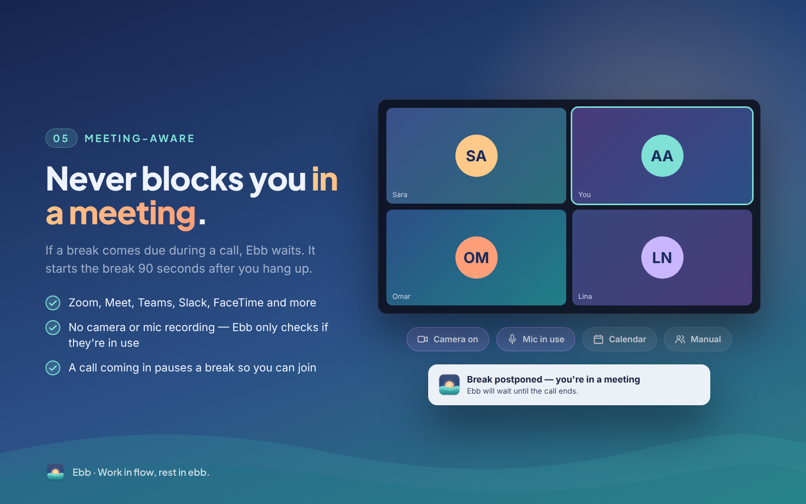
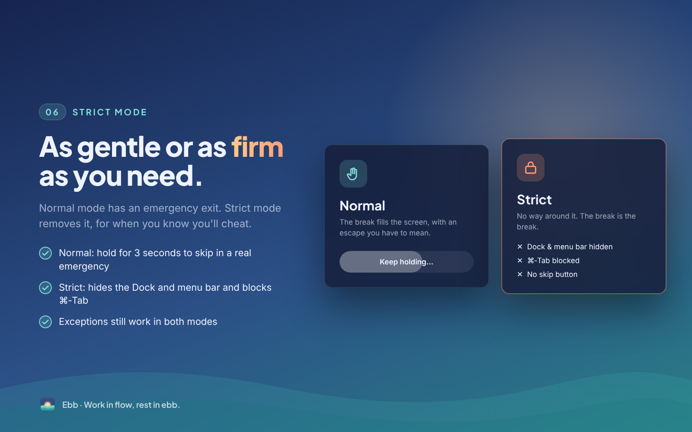
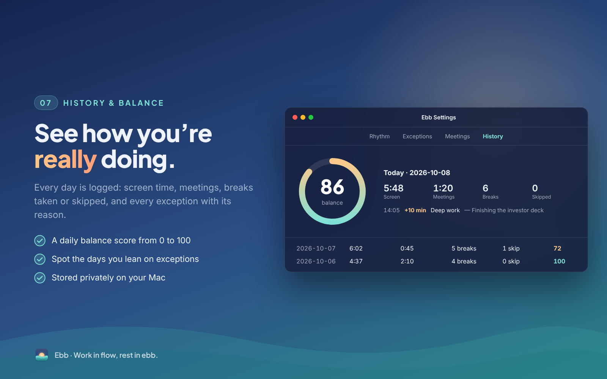

<p align="center"></p>

<h1 align="center">Ebb</h1>
<p align="center"><b>Work in flow, rest in ebb.</b><br>
A macOS menu-bar app that makes you take screen breaks, lets you ask for more time when it matters, and never interrupts a meeting.</p>

---

## What it does











Full design, state machine and roadmap: **[docs/PRODUCT.md](docs/PRODUCT.md)**. How it is tested: **[docs/TESTING.md](docs/TESTING.md)**.

## Install (no coding needed)

1. Download **Ebb.zip** from the latest release on the [Releases page](../../releases/latest), then unzip it.
2. Drag **Ebb** into **Applications** and open it.
3. The first time, macOS blocks it because the developer isn't verified. Go to **System Settings → Privacy & Security** and click **Open Anyway**.

Needs macOS 14+, and works on Apple Silicon and Intel Macs.

## Publishing a new version

```bash
git tag v0.2.0 && git push origin v0.2.0
```
GitHub Actions then tests the code, builds a universal `Ebb.app`, and publishes a release with `Ebb.zip` attached.

## Build & run (on your Mac)

Needs macOS 14+ and Xcode 15+ (or just the Command Line Tools: `xcode-select --install`).

```bash
git clone https://github.com/abdullah-abdullatif/ebb.git
cd ebb
make test      # run the state-machine unit tests
make run       # build build/Ebb.app and launch it
make install   # copy to /Applications (needed for "Open at login")
```

Ebb shows up in the menu bar as `≋ 49:58`, with no Dock icon.

**To work on it in Xcode:** `open Package.swift`, choose the *Ebb* scheme, then Run.
(When run from Xcode the binary isn't inside a `.app`, so notifications and launch-at-login are disabled. Use `make run` to test those.)

### Permissions

| Feature | Permission |
|---|---|
| Idle detection | none |
| Camera / mic "in use" detection | none: Ebb asks macOS whether a device is in use and never opens it |
| Calendar meetings (opt-in) | Calendar access, asked when you enable it |
| Notifications | Asked on first launch |

### Quick test settings

To see a break quickly, open **Settings → Rhythm**, set *Work* to 10 min and *Break* to 1 min, or click **Take a break now** in the menu.

## Project layout

```
Package.swift
Sources/Ebb/
  App/        EbbApp (MenuBarExtra + Settings)
  Core/       SessionClock (pure state machine), SessionEngine, Preferences, StatsStore, Notifier
  Detection/  ActivityMonitor (idle), MeetingDetector (camera/mic/calendar)
  UI/         BreakOverlayController, BreakView, ExceptionRequestView, MenuBarView, SettingsView, Theme
Tests/EbbTests/   SessionClock tests
Resources/        Info.plist, AppIcon.svg, AppIcon.png
scripts/          build-app.sh, make-icns.sh
```
